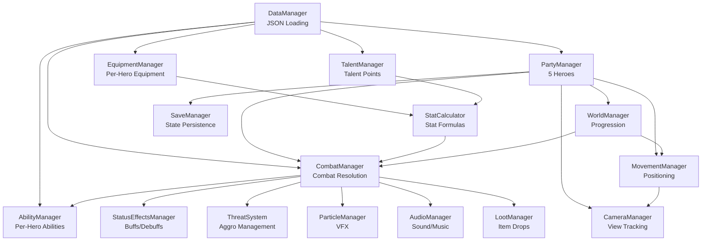
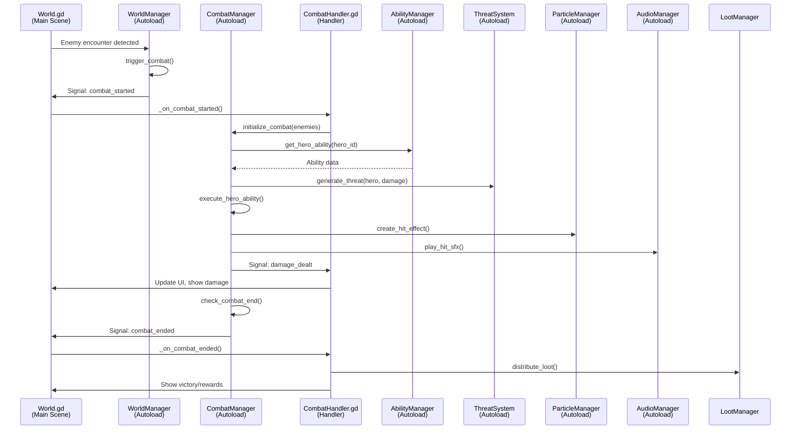
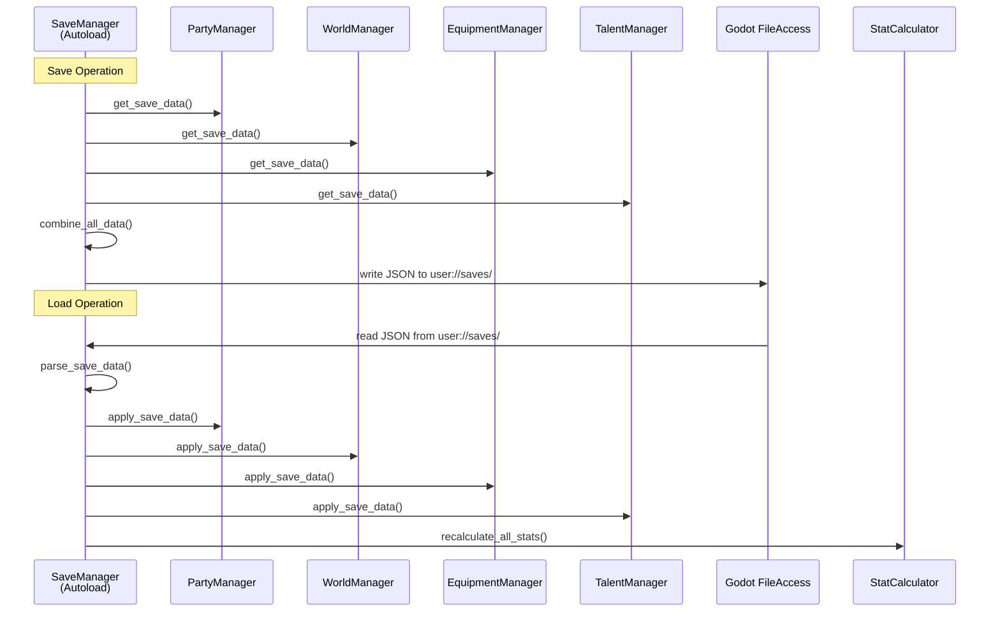

# System Relationships Map

This document visualizes manager dependencies, communication flows, and system relationships for instant system understanding. Use this to navigate complex systems and understand impact when making changes.

## Manager Dependency Graph



## Critical Communication Flows

### Combat Flow



### Data Flow

```mermaid
graph LR
    JSON[abilities.json<br/>items.json<br/>enemies.json<br/>talents.json]
    DataMgr[DataManager<br/>Autoload]
    AbilityMgr[AbilityManager]
    EquipmentMgr[EquipmentManager]
    CombatMgr[CombatManager]
    TalentMgr[TalentManager]
    
    JSON -->|Load on startup| DataMgr
    DataMgr -->|get_ability_data()| AbilityMgr
    DataMgr -->|get_item_data()| EquipmentMgr
    DataMgr -->|get_enemy_data()| CombatMgr
    DataMgr -->|get_talent_data()| TalentMgr
    
    DataMgr -.->|Hot Reload<br/>dev mode| AbilityMgr
    DataMgr -.->|Hot Reload<br/>dev mode| EquipmentMgr
```

### Equipment Flow

```mermaid
graph TD
    LootMgr[LootManager<br/>Item Drop]
    EquipmentMgr[EquipmentManager<br/>Inventory Management]
    StatCalc[StatCalculator<br/>Stat Calculation]
    CombatMgr[CombatManager<br/>Apply Stats]
    Hero[Hero Resource<br/>Current Stats]
    UI[CharacterPanel.gd<br/>Display]
    
    LootMgr -->|item_dropped| EquipmentMgr
    EquipmentMgr -->|equip_item()| EquipmentMgr
    EquipmentMgr -->|get_equipment_stats()| StatCalc
    StatCalc -->|calculate_final_stats()| Hero
    Hero -->|stat_changed signal| CombatMgr
    Hero -->|stat_changed signal| UI
    CombatMgr -->|use stats in combat| CombatMgr
```

### Save/Load Flow



### Talent Allocation Flow

```mermaid
graph TD
    TalentUI[TalentAllocation.gd<br/>UI Scene]
    TalentMgr[TalentManager<br/>Autoload]
    StatCalc[StatCalculator<br/>Recalculate]
    Hero[Hero Resource<br/>Updated Stats]
    CombatMgr[CombatManager<br/>Use New Stats]
    
    TalentUI -->|allocate_talent_point()| TalentMgr
    TalentMgr -->|update_hero_talents()| Hero
    TalentMgr -->|talent_changed signal| StatCalc
    StatCalc -->|calculate_final_stats()| Hero
    Hero -->|stat_changed signal| CombatMgr
    TalentUI -->|update UI display| TalentUI
```

## Signal Communication Patterns

### Manager-to-Manager Communication

**Pattern**: Autoload signals (signals defined on manager classes)

```gdscript
# Manager A emits signal
signal value_changed(new_value: int)

# Manager B connects in _ready()
func _ready() -> void:
    ManagerA.value_changed.connect(_on_value_changed)

func _on_value_changed(new_value: int) -> void:
    # Handle value change
```

**Examples**:
- `CombatManager.combat_started` → `ParticleManager` (create combat effects)
- `CombatManager.damage_dealt` → `AudioManager` (play hit sounds)
- `WorldManager.mile_changed` → `HUD.gd` (update progress bar)
- `WorldManager.mile_changed` → `QuestManager` (check reach_mile quests)
- `CombatManager.combat_ended` → `QuestManager` (check kill quests)
- `QuestManager.quest_progress_updated` → `QuestTracker.gd` (update quest UI)
- `QuestManager.quest_completed` → `QuestTracker.gd` (remove completed quest from UI)
- `EquipmentManager.equipment_changed` → `StatCalculator` (recalculate stats)

### Manager-to-Scene Communication

**Pattern**: Scene scripts connect to manager signals

```gdscript
# In scene script (World.gd, HUD.gd, etc.)
func _ready() -> void:
    CombatManager.combat_started.connect(_on_combat_started)
    WorldManager.mile_changed.connect(_on_mile_changed)

func _on_combat_started() -> void:
    # Update UI, show combat UI elements
```

**Examples**:
- `CombatManager` signals → `World.gd` (update combat UI)
- `WorldManager` signals → `HUD.gd` (update progress, mile counter)
- `WorldManager` signals → `QuestManager` (update reach_mile quests)
- `CombatManager` signals → `QuestManager` (update kill quests)
- `QuestManager` signals → `QuestTracker.gd` (update quest UI display)
- `PartyManager` signals → `CharacterPanel.gd` (update hero display)

### Scene-to-Manager Communication

**Pattern**: Direct Autoload access (no signals needed for one-way calls)

```gdscript
# In scene script
func _on_button_pressed() -> void:
    EquipmentManager.equip_item(hero_id, item_id)
    # Manager emits signal if other systems need to know
```

**Examples**:
- `CharacterPanel.gd` → `EquipmentManager.equip_item()` (user clicks equip)
- `TalentAllocation.gd` → `TalentManager.allocate_point()` (user allocates talent)
- `World.gd` → `SaveManager.save_game()` (user clicks save)

## System Dependency Matrix

| Manager | Depends On | Used By |
|---------|------------|---------|
| **DataManager** | None (base) | All managers that need JSON data |
| **PartyManager** | DataManager | WorldManager, CombatManager, MovementManager, CameraManager |
| **WorldManager** | PartyManager, DataManager | World.gd, CombatManager |
| **CombatManager** | PartyManager, AbilityManager, ThreatSystem, StatusEffectsManager, StatCalculator | World.gd, CombatHandler.gd |
| **AbilityManager** | DataManager, ResourceManager | CombatManager |
| **EquipmentManager** | DataManager | StatCalculator, CharacterPanel.gd |
| **StatCalculator** | EquipmentManager, TalentManager, PartyBuffSystem | CombatManager, Hero resources |
| **TalentManager** | DataManager | StatCalculator, TalentAllocation.gd |
| **ThreatSystem** | None (utility) | CombatManager |
| **StatusEffectsManager** | None (utility) | CombatManager |
| **MovementManager** | PartyManager | WorldManager, CameraManager |
| **CameraManager** | PartyManager, MovementManager | World.gd |
| **ParticleManager** | None (utility) | CombatManager, World.gd |
| **AudioManager** | None (utility) | CombatManager, World.gd |
| **LootManager** | DataManager, EquipmentManager | CombatManager |
| **QuestManager** | DataManager, WorldManager, CombatManager | QuestTracker.gd (HUD) |
| **SaveManager** | All managers (via get_save_data) | SaveLoad.gd, Options.gd |

## Critical Integration Points

### 1. Combat Initialization
**Location**: `World.gd` → `CombatHandler.gd` → `CombatManager.gd`
**Dependencies**: WorldManager, PartyManager, AbilityManager, ThreatSystem
**Critical**: Must check for party structure before single-hero logic

### 2. Stat Recalculation
**Location**: `EquipmentManager` / `TalentManager` → `StatCalculator` → `Hero` resource
**Dependencies**: EquipmentManager, TalentManager, PartyBuffSystem, StatCalculator
**Critical**: Must recalculate after any equipment or talent change

### 3. Save/Load Cycle
**Location**: `SaveManager` → All managers (get_save_data / apply_save_data)
**Dependencies**: All game state managers
**Critical**: Must maintain save format compatibility, recalculate stats after load

### 4. Scene Transitions
**Location**: `SceneManager` → Scene scripts → Manager cleanup
**Dependencies**: All scene scripts, signal connections
**Critical**: Must disconnect signals in `_exit_tree()` to prevent leaks

### 5. Hot Reload (Development)
**Location**: `GameplayDataHotReload` → DataManager → Affected managers
**Dependencies**: DataManager, all data-driven managers
**Critical**: Must implement `reload_*_data()` methods in managers

### 6. Quest System Updates
**Location**: `WorldManager` / `CombatManager` → `QuestManager` → `QuestTracker.gd`
**Dependencies**: WorldManager (mile changes), CombatManager (combat ended), QuestManager, QuestTracker
**Critical**: Quest progress must update in real-time via signals, QuestTracker must refresh on quest load

## Impact Analysis Guide

When modifying a system, check this map to identify:

1. **Direct Dependencies**: Managers this system depends on (read up the dependency graph)
2. **Dependents**: Systems that depend on this system (read down the dependency graph)
3. **Signal Connections**: What signals this system emits/connects to
4. **Data Flow**: How data moves through this system
5. **Integration Points**: Critical paths that touch this system

### Example: Modifying CombatManager

**Dependencies to Check**:
- PartyManager (party structure)
- AbilityManager (ability data)
- ThreatSystem (threat calculations)
- StatCalculator (hero stats)

**Dependents to Update**:
- CombatHandler.gd (if combat flow changes)
- World.gd (if combat events change)
- ParticleManager (if combat signals change)
- AudioManager (if combat signals change)

**Signals to Verify**:
- `combat_started` (emitted to)
- `damage_dealt` (emitted to)
- `combat_ended` (emitted to)

**Data Flow Impact**:
- Combat initialization
- Damage calculation
- Threat generation
- Loot distribution

## Navigation Quick Reference

**Need to understand combat?** → See Combat Flow diagram
**Need to modify equipment?** → See Equipment Flow diagram
**Need to add a save field?** → See Save/Load Flow diagram
**Need to add a signal?** → See Signal Communication Patterns
**Need to find dependencies?** → See System Dependency Matrix
**Making a change?** → See Impact Analysis Guide

**Last Updated**: January 2026
**Quick Reference**: See Navigation Quick Reference section for common queries
